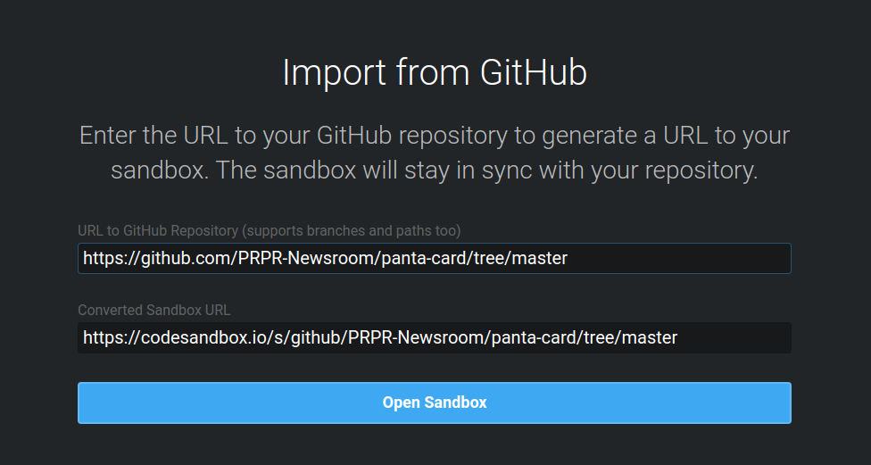
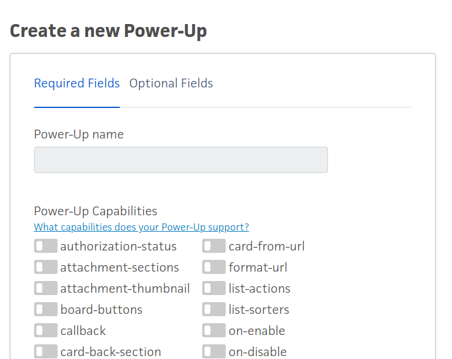
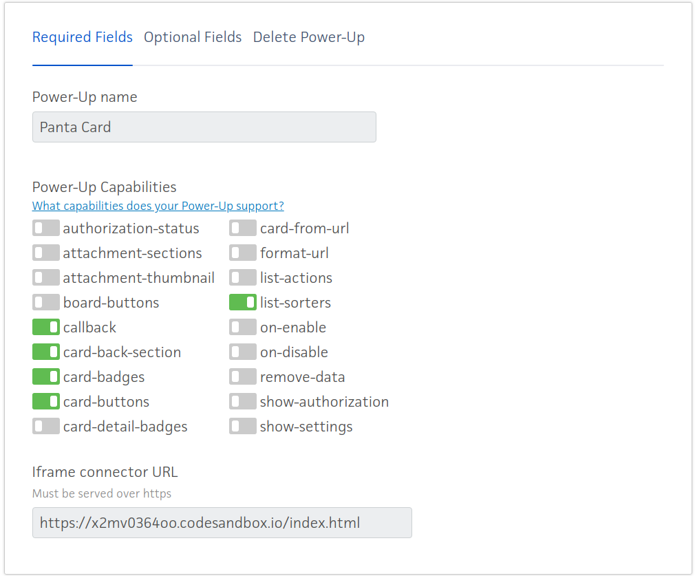
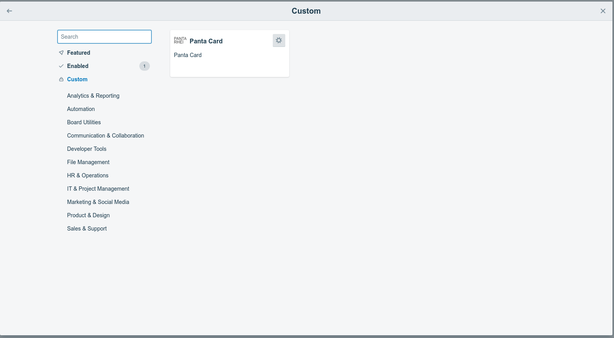
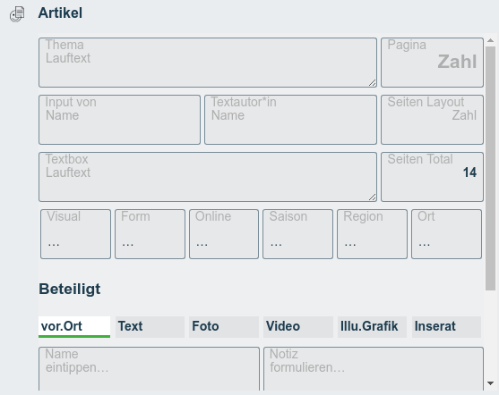
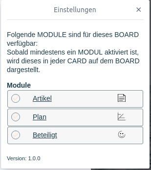

# Panta.Card Power-Up

Das Panta.Card Power-Up umfasst folgende Module:

* Panta.Artikel
* Panta.Plan
* Panta.Beteiligt

Pro Trello Board werden die Module konfiguriert. 

## Source-Code

Auf GitHub wird der Source-Code des Power-Ups versioniert. 

Der Besitzer ist PRPR-Newsroom: https://github.com/PRPR-Newsroom/panta-card

## CodeSandbox

Da GitHub seinen Dienst ([RawGit](https://rawgit.com/)) seit 2018/2019 eingestellt hat, wird
CodeSandbox für das Bereitstellen des Power-Ups verwendet.

Um das Projekt in CodeSandbox zu importieren, einfach den GitHub Repository Link auf der
Webseite https://codesandbox.io/s/github eingeben.

Den Link "Converted Sandbox URL" wird für die Installation des Trello Power-Ups
verwendet.

## Installation

Das Power-Up wird auf [Power-Up Admin Seite](https://trello.com/power-ups/admin) konfiguriert.

### Konfiguration

Die Konfiguration für das Power-Up "Panta.Card" für das Team "PRPR.9.labor"

## Weitere Teams

Um das Panta.Card Power-Up für andere Teams zu installieren, einfach auf die
[Power-Up Admin Seite](https://trello.com/power-ups/admin) navigieren und dort
das Team auswählen. Danach ein neues Power-Up erstellen und das Power-Up wie
oben aufgezeigt konfigurieren.

## Power-Up einschalten

Sobald das Power-Up für ein Team konfiguriert ist, kann es in den Boards aktiviert
werden.

Nachdem das Power-Up aktiviert wurde, erscheint es in den Trello Cards.

## Panta.Card Konfiguration

Für jedes Trello Board können die drei Module konfiguriert werden. Um das Power-Up zu konfigurieren, muss zunächst eine Trello Card
erstellt und geöffnet werden. In der Trello Card gibt's auf der rechten Seite ein Button "Panta.Card.Setup". Als Administrator des Power-Ups
wird beim Klick auf den Knopf folgende Seite geladen:

Das entsprechende Modul kann mit der Checkbox (rundes Kästchen) (de-)aktiviert werden. Wenn auf den Modul-Namen
geklickt wird, dann wird die Modul-Konfiguration geöffnet.

Die Konfigurations-Möglichkeiten werden in den einzelnen Seiten erklärt.

# Debugging

Evtl. in `utils.js` ein Breakpoint im `tryCatcher` setzen, da der Fehler in diesem Block geschluckt wird