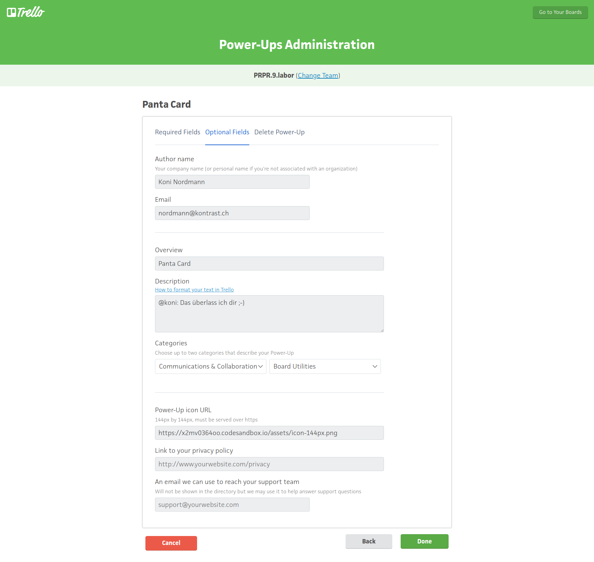

# Panta.Card Power-Up

Dieses Panta.Card Power-Up umfasst beide Module:

* Panta.Artikel
* Panta.Beteiligt

Zukünftig wird es noch ein weiteres Modul geben "M-PR-Plan".

Da nicht jede Agentur/Projekt die gleichen Module braucht, wird es mehrere Power-Up
Projekte geben, die dann die entsprechenden Module konfiguriert haben, d.h. bspw. ein
Power-Up mit nur dem Modul "Panta.Artikel" oder ein Power-Up mit den Modulen
"Panta.M-PR-Plan" und "Panta.Beteiligt". Zusätzlich werden wahrscheinlich noch weitere
Module dazukommen, wenn es weitere Projekte/Kunden gibt.

## Source-Code

Auf GitHub wird der Source-Code des Power-Ups versioniert.

### Sub-Modules

Für diese Modul-Zusammenstellung kann evtl. die Git "Sub-Module" Funktionalität
verwendet werden. Damit lassen sich Basis-Module in mehrere Projekten (hier Power-Ups)
einbinden, wodurch Änderungen nur an einer Stelle gemacht werden können und alle
Projekte, die das Modul einbinden, profitieren von diesen Änderungen.

## CodeSandbox

Da GitHub seinen Dienst ([RawGit](https://rawgit.com/)) seit kurzen eingestellt hat, wird
CodeSandbox für das Bereitstellen des Power-Ups verwendet.

Um das Projekt in CodeSandbox zu importieren, einfach den GitHub Repository Link auf der
Webseite https://codesandbox.io/s/github eingeben.

Den Link "Converted Sandbox URL" wird für die Installation des Trello Power-Ups
verwendet.

## Installation

Das Power-Up wird auf [Power-Up Admin Seite](https://trello.com/power-ups/admin) konfiguriert.

### Konfiguration

Die Konfiguration für das Power-Up "Panta.Card" für das Team "PRPR.9.labor"

## Weitere Teams

Um das Panta.Card Power-Up für andere Teams zu installieren, einfach auf die
[Power-Up Admin Seite](https://trello.com/power-ups/admin) navigieren und dort
das Team auswählen. Danach ein neues Power-Up erstellen und das Power-Up wie
oben aufgezeigt konfigurieren.

## Power-Up einschalten

Sobald das Power-Up für ein Team konfiguriert ist, kann es in den Board aktiviert
werden.

Nachdem das Power-Up aktiviert wurde, erscheint es in den Trello Cards

